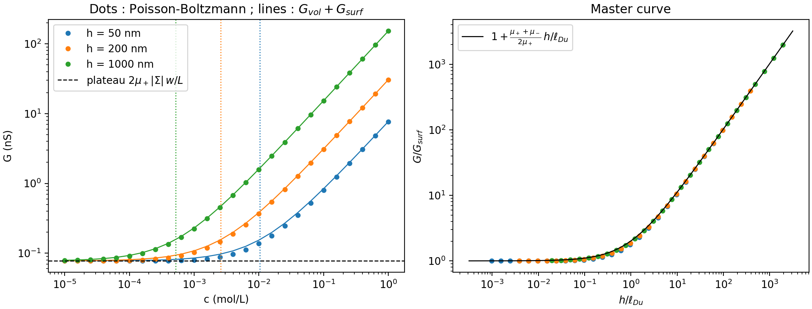
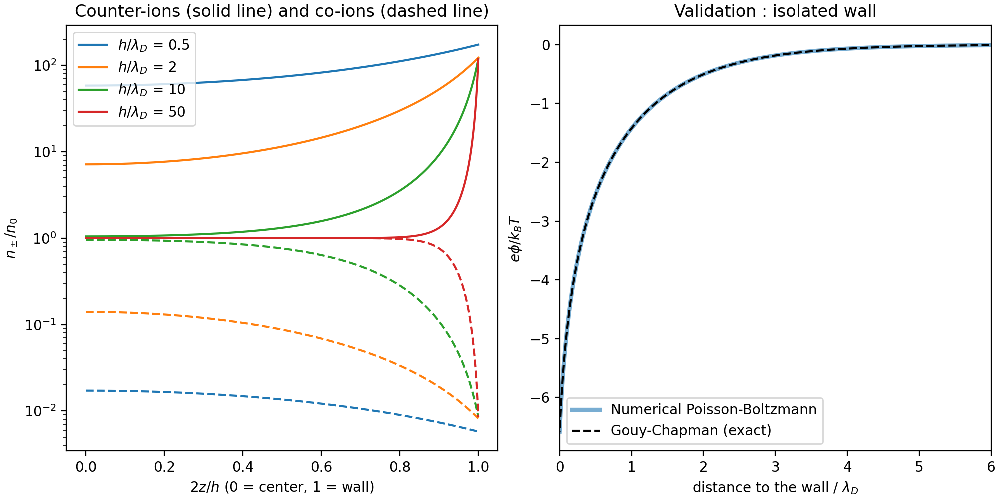

## Exploration of conductance saturation in a charged nanoslit

In this code, we implement a Poisson-Boltzmann solver in a charged nanoslit and calculate the ionic conductance. We are thus able to reproduce the conductance saturation phenomenon, where transport is determined by counter-ions from the electic double layer.

## The physics behind

- Combining the Poisson equation with Boltzmann's distribution yields

Ψ'' = sinh(Ψ)/λ_D²

with boundary conditions

Ψ'(0) = 0 (by symetry of the system)
Ψ'(h/2) = eΣ/εk_BT

- Conductance by migration is given by :

G = (w/L)e∫(µ+n+ + µ-n-)dz

Furthermore, ∫ (µ+n+ + µ-n-) = 2|Σ|/e yields the following identity

G = (w/L)e∫(µ+ + µ-)n0h + (w/L)2µ+|Σ| - (w/L)e(µ+ + µ-)Δ

Where the first term is the volumetric conductance G_vol, the second the surface conductance G_surf and Δ = ∫(n0 - n-)dz >= 0 is the co-ions deficit, representing the anions repulsed by the wall.

Therefore the simple model G_bol + G_surf is an upper bound, which becomes accurate at high concentration (Δ << n0h) and low concentration (Δ <= n0h << |Σ|/e)

G_surf/G_vol ~= l_Du/h where l_Du = |Σ|/en0 is the Dukhin length, from which we deduce the transition concentration c\* where l_Du = h :

c* = |Σ|/(ehN_A*10e3)

The plateau G_surf = 2µ+|Σ|(w/L) does not depend on h.

## Results

At h/λ_D = 0.5, we notice the absence of co-ions inside the nanoslit. Indeed, the negative potentials from the walls are added and never fall to zero, which results in a continuous electrostatic barrier. The negatively charged anions are repulsed by the electrostatic field and are thus blocked at the entry of the nanoslit. Subsequently, global electroneutrality imposes the compensation of the negative charge at the gates of the nanoslit, forcing cations to fill it. Therefore the fluid inside the slit becomes a unipolar fluid filled with cations, and applying a voltage at the extremities of the channel will lead to an electric current entirely transported by the present ions. Thus, the slit behaves as a diode or a perfect filter, allowing the circulation of cations and blocking anions.

On the left figure, we notice that all curves for different values of h converge towards the same plateau at low concentrations. This observation matches our decomposition G = G_vol + G_surf. Indeed, at very low concentrations, indisponibility of ions leads to the collapse of the volumetric term G_vol dependent on h, to the point where it becomes negligeable. Therefore, we are left with the surface term G_surf = (w/L)2µ+|Σ|, that does not depend on h.

The total amount of cations necessary to neutralize the wall is given solely by the charge density |Σ| of the latter wall. No matter where the ceiling of channel is located, the charge to compensate remains the same. The number of charge transporters is therefore locked by the surface, making the conductance independ of the channel's height.

Moreover, we can notice that our figure is in good accordance with the expected transition at c*, transitioning from a linear model to a decreasing exponential exactly at c* for each value of h.

Next, on the right figure, we notice that all the points follow the same curve. Indeed, the only dimensionless parameter that governs this universal behaviour is h/l_Du, i.e. the ratio between the channel height and the Dukhin length.

As dhowed by the horizontal axis in the right figure, this parameter condenses all variables of the system into an only indicator.

- Surface regime : the channel is very confined with respect to the Dukhin length, and therefore total conductance is reduced to the surface conductance (horizontal plateau at 1 on the vertical axis)

- Volume regime : the height of the channel is way larger than the Dukhin length, therefore the ions cloud becomes negligeable with respect to the volume of salted water, and points follow a linear regime.

Finally, on the second curve, we can notice that amidst the transition, the points are slightly under the curve. This is a limit of the theoretical additive model G_vol + G_surf. Indeed, this formula supposes that the volumetric conductance is added independently, as if the channel always kept a constant concentration in salt of n0. In reality, in the transtiion zone (h/l_Du ~= 1), the thickness of the double layers occupies a significant proportion of the channel. The electric field at the walls starts to repulse co-ions towards external reservoirs. Because of this partial exclusion, the channel globally contains less co-ions than what is predicted by the sole addition of a theoretical volume and surface. On the other hand, the solver takes into accound that local ionic rarefaction, explaining the small gap that we observe.

## Limits of the model

- We neglected the electro-osmotic convection, meaning that we supposed that water stays perfectly still, where in reality, the movements of the counter-ions cloud caused by the electric field causes the fluid itself to move by viscous friction. That water flow pushes ions, increasing mobility and real surface conductance.
- The Poisson-Boltzmann equation treats ions as points without volume. At high salinity, the model will predict a density of ions close to the wall that surpasses the physical limit imposed by steric effects.
- In reality, the charge of a wall like silica is not a constant. It depends on the protonationn or deprotonation of silanol functions following salinity and local pH. That is why the experimentally observed conductance plateau is never fully horizontal.

## Usage

pip install -r requirements.txt
python make_figures.py
